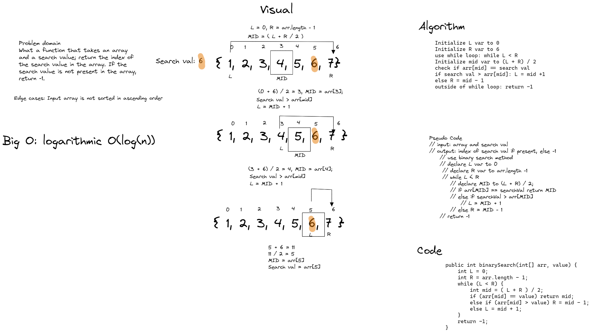

# Array Binary Search
- Write a function called BinarySearch which takes in 2 parameters: a sorted array and the search key. Without utilizing any of the built-in methods available to your language, return the index of the array’s element that is equal to the value of the search key, or -1 if the element is not in the array.## Whiteboard Process
## Whiteboard Process

## Approach & Efficiency
- I utilized a binary search algorithm to achieve a time complexity of O(log(n)). I used two pointer variables, a left and right, along with a middle var that was the average of the two indexes. I also used a while loop that ran while L < R, and returned -1 outside of the loop. Upon exiting the loop, we can assume that no such value was found and return -1.