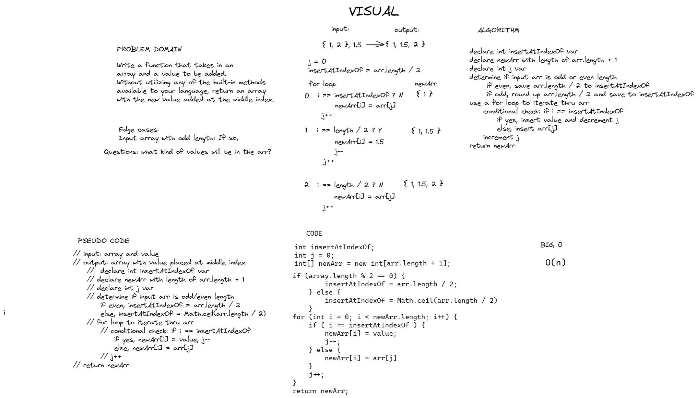

# Insert and Shift an Array
- Write a function called insertShiftArray which takes in an array and a value to be added. Without utilizing any of the built-in methods available to your language, return an array with the new value added at the middle index.
## Whiteboard Process

## Approach & Efficiency
- I utilized an iterative method to solve the challenge via for loop. I did this, as there is no splice/slice native method in Java with standard arrays. Due to this I had to iterate through the array, and add in the value upon reaching the middle index. Because this is an iterative solution, the time complexity is O(n). We declare a total of 3 new variables in terms of space complexity.