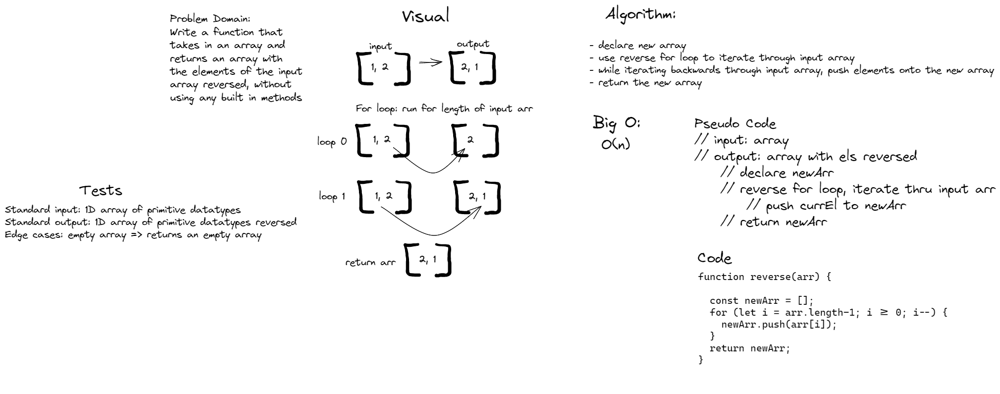

# Reverse an Array
- Write a function called reverseArray which takes an array as an argument. Without utilizing any of the built-in methods available to your language, return an array with elements in reversed order.

## Whiteboard Process

## Approach & Efficiency
<!-- What approach did you take? Discuss Why. What is the Big O space/time for this approach? -->
- I used a reverse for loop to iterate backwards through the input arr, pushing each element onto a new array. After the loop I returned the newArr.
- I did this because it is the way I would normally solve a problem such as this, via iteration
- The time complexity of this solution is O(n). 