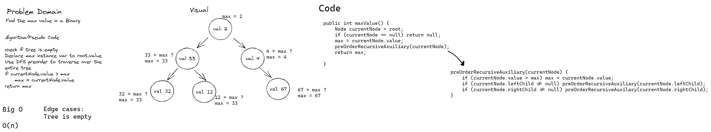

# Challenge Summary
Find the maximum value in a Binary Tree

## Whiteboard Process

## Approach & Efficiency
The method findMax, traverses the tree using a pre-order recursive algorithm. Within this algorithm, a conditional statement checks if the currentNode value is greater than the current value assigned to an int max instance variable
Due to traversing the entire tree, and not being a binary search tree, time complexity is O(n). Space complexity of the tree is W(n) + 1, due to the instance variable to which we save the max int value.

## Solution