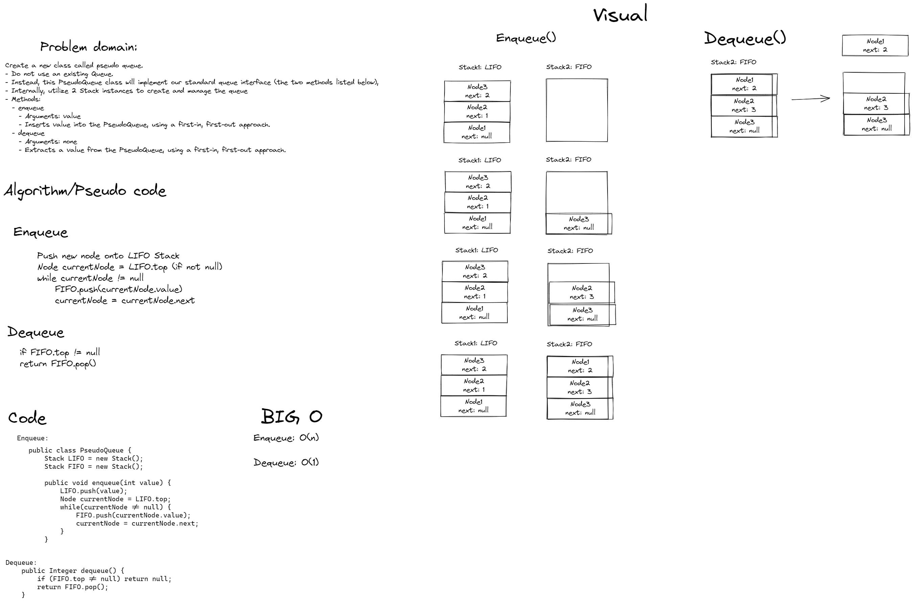

# Pseudo Queue

- Create a new class called pseudo queue.
- Do not use an existing Queue.
- Instead, this PseudoQueue class will implement our standard queue interface (the two methods listed below),
- Internally, utilize 2 Stack instances to create and manage the queue
- Methods:
  - enqueue
    - Arguments: value
    - Inserts value into the PseudoQueue, using a first-in, first-out approach.
  - dequeue 
    - Arguments: none
    - Extracts a value from the PseudoQueue, using a first-in, first-out approach.

## Whiteboard Process


## Approach & Efficiency
To do this challenge, I used two stacks as instance variable within the PseudoQueue Class, one named LIFO and the other FIFO. Enqueue is a O(n) operation, depending on how many pre-existing nodes there are in the FIFO stack. Essentially, when the enqueue method is invoked, a new node is instantiated and pushed onto the LIFO stack. This operation is O(1). Then, the LIFO stack is traversed and each node value is pushed onto the FIFO stack, inverting the order of nodes. This operation is O(n), as we have to traverse the entirety of the LIFO stack. 
Dequeue is a 0(1) operation, and invokes the pop() method on the instance's FIFO stack property. 
NOTE: FIFO acts as the pseudo-queue and should be used to access node values.

## Solution
```java public class PseudoQueue {
    Stack LIFO = new Stack();
    Stack FIFO = new Stack();

    public void enqueue(int value) {
        LIFO.push(value);
        Node currentNode = LIFO.top;
        while(currentNode != null) {
            FIFO.push(currentNode.value);
            currentNode = currentNode.next;
        }
    }

    public Integer dequeue() {
        if (FIFO.top != null) return null;
        return FIFO.pop();
    }
}
```