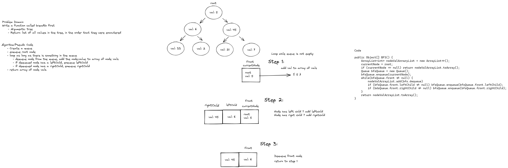

# Challenge Summary
- Write a function called breadth first
- Arguments: tree
- Return: list of all values in the tree, in the order that they were encountered

## Whiteboard Process


## Approach & Efficiency
The breadth first search employs a queue data structure to keep track of each node level.
Due to the nature of using a queue system, in order to fully traverse the tree, time complexity is O(n)


## Solution
```java public Object[] breadthFirst() {
        Node currentNode = root;
        ArrayList<Integer> nodeValArrayList = new ArrayList<>();
        if (currentNode == null) return nodeValArrayList.toArray();
        ArrayList<Node> Queue = new ArrayList<>();
        Queue.add(currentNode);
        while(Queue.size() > 0) {
            Node front = Queue.remove(0);
            nodeValArrayList.add(front.value);
            if (front.leftChild != null) Queue.add(front.leftChild);
            if (front.rightChild != null) Queue.add(front.rightChild);
        }
        return nodeValArrayList.toArray();
    }
