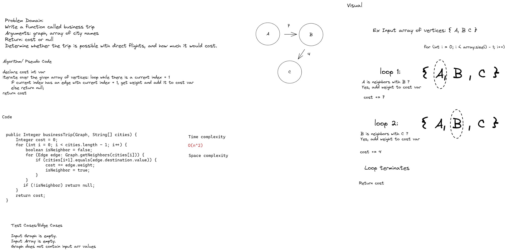

# Challenge Summary
Write a function called business trip
- Arguments: graph, array of city names
- Return: cost or null
- Determine whether the trip is possible with direct flights, and how much it would cost.

## Whiteboard Process

## Approach & Efficiency
Time complexity is O(n^2) due to having to iterate over an array of vertices, and then iterate over their respective arrays of neighbors.

## Solution
WIP