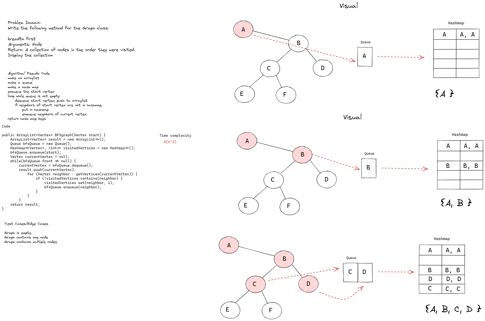

# Challenge Summary
Write the following method for the Graph class:

breadth first
- Arguments: Node
- Return: A collection of nodes in the order they were visited.
- Display the collection

## Whiteboard Process


## Approach & Efficiency
The breadth first search employs a queue data structure to keep track of each vertex and its subsequent neighbors.
Due to the nature of using a queue with a while loop, as well as having to traverse over the linked list of neighbors between loops, time complexity is O(n^2)


## Solution
```
public ArrayList<Vertex<T>> BFSgraph(Vertex<T> start) 
{
        ArrayList<Vertex<T>> result = new ArrayList<>();
        Deque<Vertex<T>> bfsQueue = new ArrayDeque<>();
        HashMap<Vertex<T>, Integer> visitedVertices = new HashMap<>(size() * 2);
        bfsQueue.addLast(start);
        Vertex<T> currentVertex = null;
        visitedVertices.set(start, 1);
        while(!bfsQueue.isEmpty()) {
            currentVertex = bfsQueue.removeFirst();
            result.add(currentVertex);
            for (int i = getNeighbors(currentVertex).size()-1; i >= 0; i--) {
                if (!visitedVertices.contains(getNeighbors(currentVertex).get(i).destination)) {
                    visitedVertices.set(getNeighbors(currentVertex).get(i).destination, 1);
                    bfsQueue.addLast(getNeighbors(currentVertex).get(i).destination);
                }
            }
        }
        return result;
}
