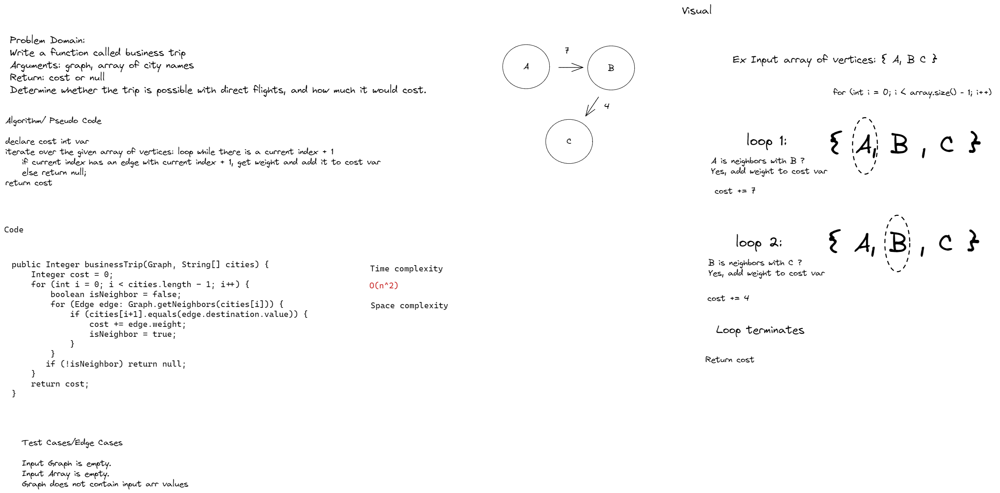

# Challenge Summary
Write a function called business trip
- Arguments: graph, array of city names
- Return: cost or null
- Determine whether the trip is possible with direct flights, and how much it would cost.

## Whiteboard Process


## Approach & Efficiency
Time complexity is O(n^2) where n is the number of edges, due to having to iterate over an array of vertices, and then iterate over their respective collections of neighbors.

## Solution
```    
    public Integer businessTrip(Graph graph, String[] cities) {
        Integer cost = 0;
        for (int i = 0; i < cities.length - 1; i++) {
            LinkedList<Edge> adjecencyList = graph.getNeighbors(cities[i]);
            Boolean isNeighbor = false;
            for (int j = 0; j < adjecencyList.size(); j++) {
                if (adjecencyList.get(j).destination.value.equals(cities[i+1])) {
                    cost += adjecencyList.get(j).weight;
                    isNeighbor = true;
                }
            }
            if (!isNeighbor) return null;
        }
        return cost;
    }