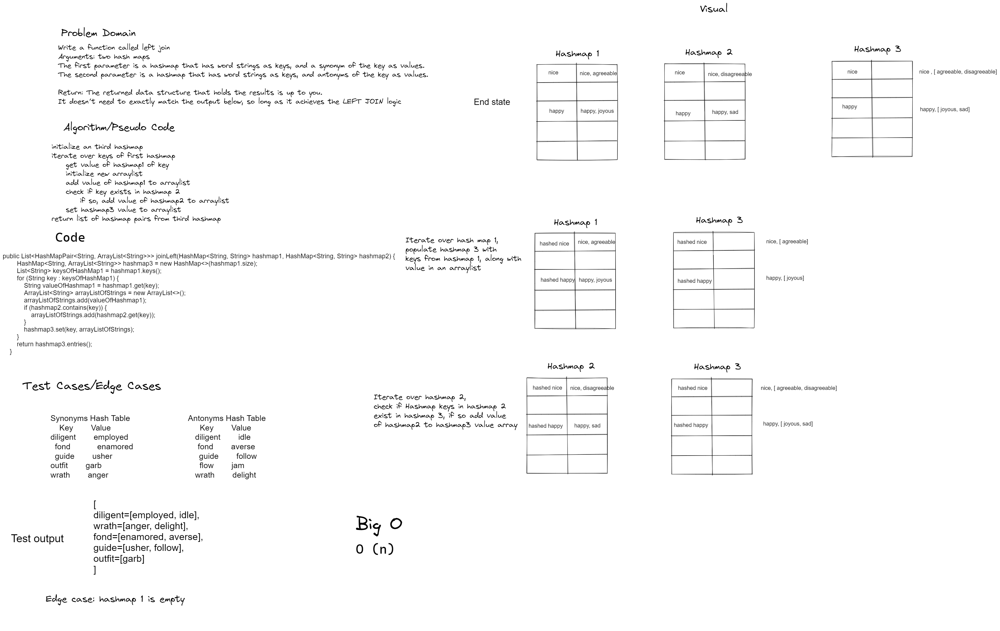

# Challenge Summary
Write a function called left join
- Arguments: two hash maps
- The first parameter is a hashmap that has word strings as keys, and a synonym of the key as values.
- The second parameter is a hashmap that has word strings as keys, and antonyms of the key as values.
- Return: The returned data structure that holds the results is up to you. It doesn’t need to exactly match the output below, so long as it achieves the LEFT JOIN logic
## Whiteboard Process


## Approach & Efficiency
- The approach uses a hash map to store common values found in both input hash maps. 
- A list of keys is obtained from the first hash map, then is iterated over via for loop. Within the for loop, the values of the keys are accessed in hashmap 1, and saved to an arraylist. Then the keys are checked if they exist in hashmap 2. If so, their respective values are added to the arraylist as well. 
- Finally, the key and arraylist are set in the new hashmap. The third hashmap then returns a list of Hash map pairs with the method .entries()
- Time complexity is O(n), as we must iterate over the list of keys returned from the first hashmap
## Solution
```    
    public List<HashMapPair<String, ArrayList<String>>> joinLeft(HashMap<String, String> hashmap1, HashMap<String, String> hashmap2) {
        if (hashmap1.keys() == null) return null;
        HashMap<String, ArrayList<String>> hashmap3 = new HashMap<>(hashmap1.size);
        List<String> keysOfHashMap1 = hashmap1.keys();
        for (String key : keysOfHashMap1) {
            String valueOfHashmap1 = hashmap1.get(key);
            ArrayList<String> arrayListOfStrings = new ArrayList<>();
            arrayListOfStrings.add(valueOfHashmap1);
            if (hashmap2.contains(key)) {
                arrayListOfStrings.add(hashmap2.get(key));
            }
            hashmap3.set(key, arrayListOfStrings);
        }
        return hashmap3.entries();
    }
    ```