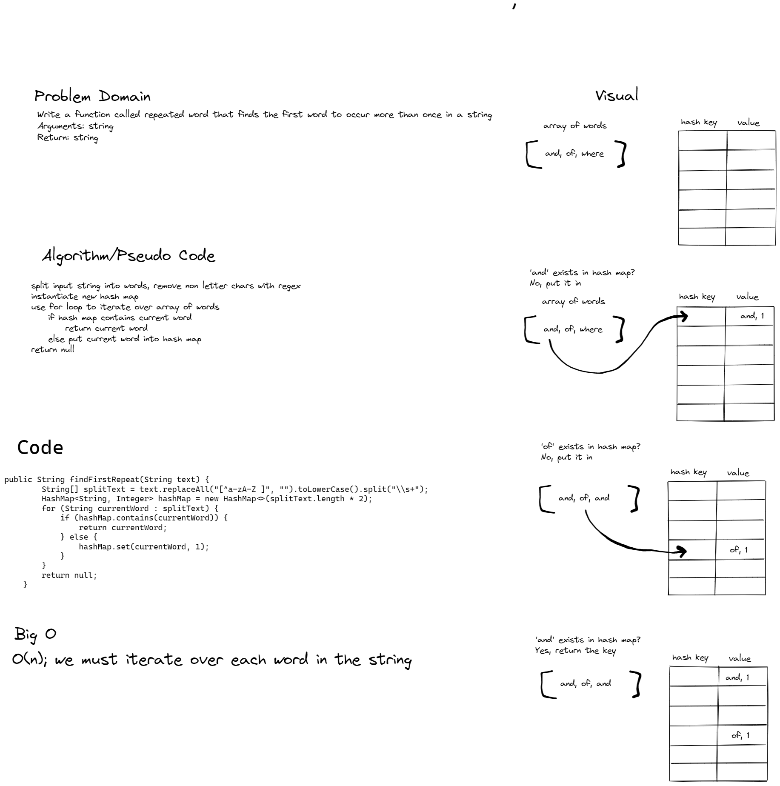

# Challenge Summary
Write a function called repeated word that finds the first word to occur more than once in a string
- Arguments: string
- Return: string

## Whiteboard Process


## Approach & Efficiency
- I used the split method and replaceAll method with regex to split the string into an array of words, removing all non-letter characters and making all letters lowercase for consistency.
- I then used a for loop to iterate over the array of words, and checked if each word already existed in a hashmap, if so returning the word and if not setting the word in the hashmap
- Due to iterating over the array of words, time complexity is O(n)

## Solution
```     public String findFirstRepeat(String text) 
        {
            String[] splitText = text.replaceAll("[^a-zA-Z ]", "").toLowerCase().split("\\s+");
            HashMap<String, Integer> hashMap = new HashMap<>(splitText.length * 2);
            for (String currentWord : splitText) {
                if (hashMap.contains(currentWord)) {
                    return currentWord;
                } else {
                    hashMap.set(currentWord, 1);
                }
            }
            return null;
        }
```