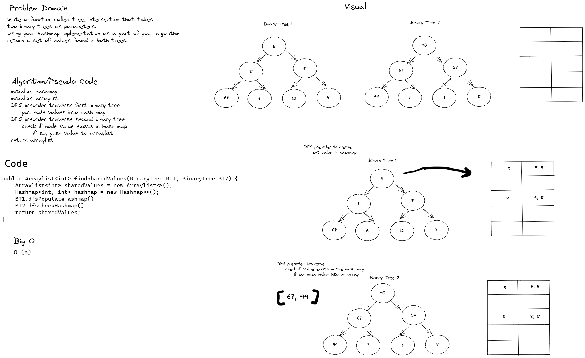

# Challenge Summary
Write a function called tree_intersection that takes two binary trees as parameters.
Using your Hashmap implementation as a part of your algorithm, return a set of values found in both trees.

## Whiteboard Process


## Approach & Efficiency
- The algo uses a hashmap and an array to store values.
- The solution uses two depth first searches on each Binary tree, the first DFS traverses the first binary tree, setting each value in the Hash map. The second DFS traverses over the second binary tree, checks if each node value is present in the hashmap, and if so pushes the value into an arraylist.
- Finally, we return the array list containing the shared values.
 
## Solution
```     
public Arraylist<int> findSharedValues(BinaryTree BT1, BinaryTree BT2) {
    Arraylist<int> sharedValues = new Arraylist<>();
    Hashmap<int, int> hashmap = new Hashmap<>();
    BT1.dfsPopulateHashmap()
    BT2.dfsCheckHashmap()
    return sharedValues;
}
```