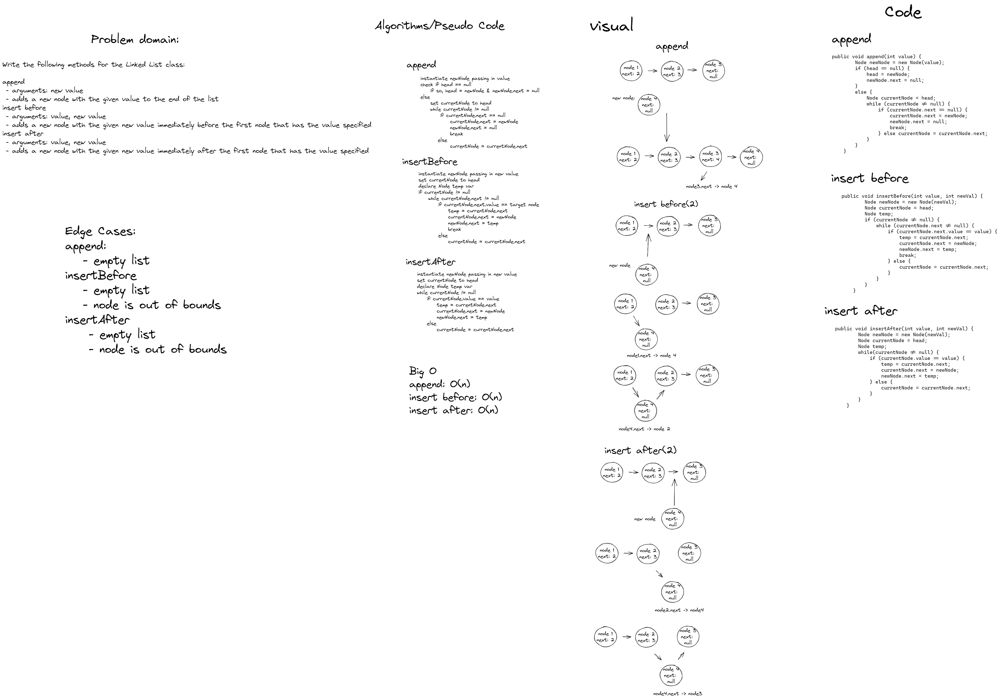

# Extending a Singly Linked List Implementation
Write the following methods for the Linked List class:

- append
  - arguments: new value
  - adds a new node with the given value to the end of the list
- insert before
  - arguments: value, new value
  - adds a new node with the given new value immediately before the first node that has the value specified
- insert after
  - arguments: value, new value
  - adds a new node with the given new value immediately after the first node that has the value specified

## Whiteboard Process:


## Approach and Efficiency:
- The time complexity for all the methods is 0(n). This is because each method requires traversal of the linked list and as such is subject to O(n) time complexity

## Solution: 
```java public void append(int value) {
        Node newNode = new Node(value);
        if (head == null) {
            head = newNode;
            newNode.next = null;
        }
        else {
            Node currentNode = head;
            while (currentNode != null) {
                if (currentNode.next == null) {
                    currentNode.next = newNode;
                    newNode.next = null;
                    break;
                } else currentNode = currentNode.next;
            }
        }
    }
    public void insertBefore(int value, int newVal) {
        Node newNode = new Node(newVal);
        Node currentNode = head;
        Node temp;
        if (currentNode != null) {
            while (currentNode.next != null) {
                if (currentNode.next.value == value) {
                    temp = currentNode.next;
                    currentNode.next = newNode;
                    newNode.next = temp;
                    break;
                } else {
                    currentNode = currentNode.next;
                }
            }
        }
    }

    public void insertAfter(int value, int newVal) {
        Node newNode = new Node(newVal);
        Node currentNode = head;
        Node temp;
        while(currentNode != null) {
            if (currentNode.value == value) {
                temp = currentNode.next;
                currentNode.next = newNode;
                newNode.next = temp;
            } else {
                currentNode = currentNode.next;
            }
        }
    }```

