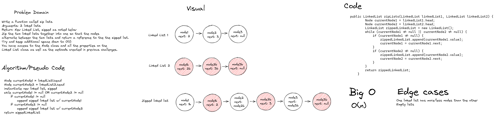

# Zip two linked lists
- Write a function called zip lists
- Arguments: 2 linked lists
- Return: New Linked List, zipped as noted below
- Zip the two linked lists together into one so that the nodes alternate between the two lists and return a reference to the the zipped list.
- Try and keep additional space down to O(1)
- You have access to the Node class and all the properties on the Linked List class as well as the methods created in previous challenges.

## Whiteboard Process


## Approach and Efficiency
In this approach, I used a while loop to traverse both linked lists simultaneously, appending the zipped linked list with each loop. Because of this, the time complexity is O(n)

## Solution
```java public LinkedList zipLists(LinkedList linkedList1, LinkedList linkedList2) {
        Node currentNode1 = linkedList1.head;
        Node currentNode2 = linkedList2.head;
        LinkedList zippedLinkedList = new LinkedList();
        while (currentNode1 != null || currentNode2 != null) {
            if (currentNode1 != null) {
                zippedLinkedList.append(currentNode1.value);
                currentNode1 = currentNode1.next;
            }
            if (currentNode2 != null) {
                zippedLinkedList.append(currentNode2.value);
                currentNode2 = currentNode2.next;
            }
        }
        return zippedLinkedList;
    }```
