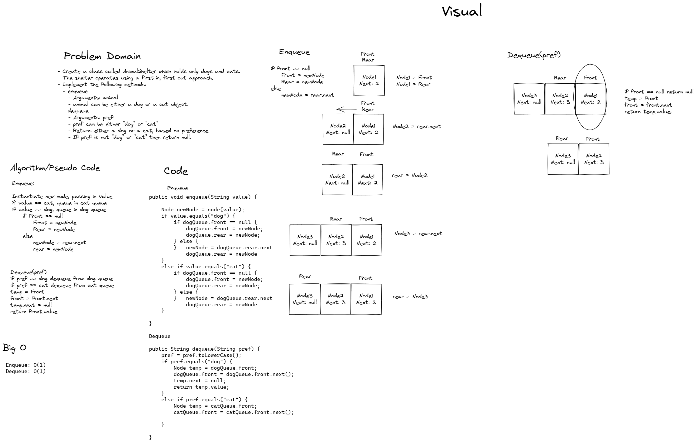

# Stack-Queue Animal Shelter

- Create a class called AnimalShelter which holds only dogs and cats.
- The shelter operates using a first-in, first-out approach.
- Implement the following methods:
  - enqueue
    - Arguments: animal
    - animal can be either a dog or a cat object.
  - dequeue
    - Arguments: pref
    - pref can be either "dog" or "cat"
    - Return: either a dog or a cat, based on preference.
    - If pref is not "dog" or "cat" then return null.

## Whiteboard Process


## Approach and Efficiency
The Animal Shelter class has two Queue class instance variables, a catQueue and a dogQueue. Using the enqueue() method, users can enqueue a dog or cat object.
The dog/cat object is then enqueued in its respective Queue.
The enqueue method operates on O(1) time complexity and the dequeue method works on O(1) time complexity. 

## Solution
```java public class AnimalShelter {
    Queue dogQueue = new Queue();
    Queue catQueue = new Queue();

    public void enqueue(String value) {
        value = value.toLowerCase(Locale.ROOT);
        if (value.equals("dog")) {
            dogQueue.enqueue("dog");
        } else if (value.equals("cat")) {
            catQueue.enqueue("cat");
        }
    }

    public String dequeue(String pref) {
        pref = pref.toLowerCase(Locale.ROOT);
        if (pref.equals("cat")) {
            return catQueue.dequeue();
        } else if (pref.equals("dog")) {
            return dogQueue.dequeue();
        }
        return null;
    }
}```

