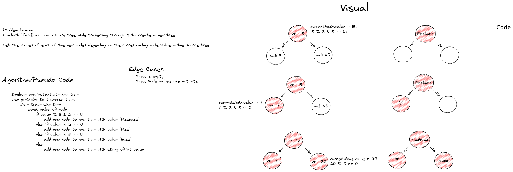

# Challenge Summary
- Write a function called fizz buzz tree
  - Agruements: k-ary tree
  - Return: new k-ary tree
- Determine whether the node value is is divisible by 3, 5 or both. Create a new tree with the same structure as the original, but the values modified as follows:
  - If the value is divisible by 3, replace the value with “Fizz”
  - If the value is divisible by 5, replace the value with “Buzz”
  - If the value is divisible by 3 and 5, replace the value with “FizzBuzz”
  - If the value is not divisible by 3 or 5, simply turn the number into a String.

## Whiteboard Process

## Approach & Efficiency

## Solution